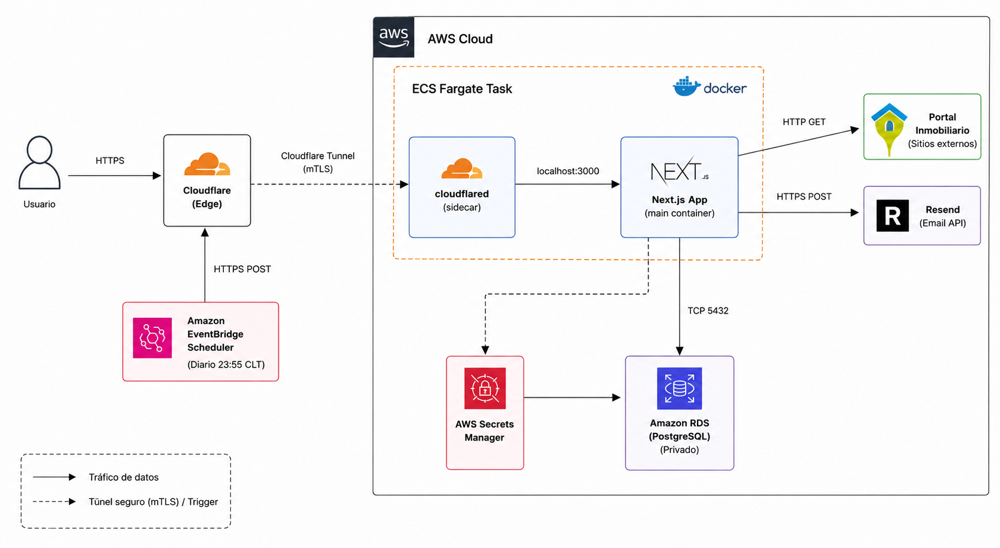

# Arquitectura del Sistema - Pruff Property Finder

El ecosistema de la plataforma se compone de múltiples piezas trabajando en conjunto dentro de AWS. A continuación, se detalla la arquitectura para comprender el flujo de datos y el despliegue.

## Componentes Principales

1. **Frontend + Backend (Next.js App)**
   - Framework: Next.js (App Router, Server Actions, Server Components).
   - Modo: Standalone.
   - Responsabilidad: Renderizar la interfaz de usuario, manejar el estado de autenticación (JWT en cookies), ejecutar el motor de scraping (HTTP requests hacia portales externos), e interactuar con la base de datos.
   - Entorno: Corre dentro de un contenedor Docker alojado en AWS ECS (Fargate) de manera Serverless.

2. **Base de Datos (RDS PostgreSQL)**
   - Motor: PostgreSQL 15.
   - Responsabilidad: Almacenar usuarios, historiales de búsqueda, favoritos, eventos de auditoría y logs de reportes diarios.
   - Seguridad: La contraseña se genera y almacena automáticamente en AWS Secrets Manager. La instancia corre en subredes privadas.
   - ORM: Prisma 7 con el adaptador `adapter-pg` y connection pooling nativo de `pg`.

3. **Capa de Conectividad (Cloudflare Zero Trust / Tunnel)**
   - Sidecar Container: `cloudflared`.
   - Responsabilidad: Actuar como un túnel inverso (Reverse Tunnel) seguro entre el clúster privado de Fargate y la red Edge de Cloudflare.
   - Flujo de Tráfico: El usuario accede a `pruff.rentario.cl` -> Cloudflare CDN/WAF -> Cloudflare Tunnel (cloudflared en Fargate) -> Redirige al `localhost:3000` del contenedor de Next.js.
   - Ventaja: Fargate no requiere balanceadores de carga (ALB), IPs públicas, ni abrir puertos de entrada en el Security Group.

4. **Automatización (AWS EventBridge Scheduler)**
   - Responsabilidad: Actuar como un Cronjob en la nube.
   - Tarea Diaria: Se dispara todos los días a las 23:55 hora de Chile.
   - Flujo: Llama de forma segura al endpoint HTTPS interno de nuestra aplicación (`/api/internal/run-daily-report`) pasando un Secret Token, lo que desencadena el envío masivo de correos vía Resend a los administradores.

5. **Infraestructura como Código (Terraform)**
   - Maneja y aprovisiona absolutamente todos los recursos de AWS asegurando un despliegue repetible e inmutable. A través de módulos específicos, Terraform configura:
     - **Redes (VPC):** Creación de la Virtual Private Cloud (VPC) base, 2 Subredes Públicas (para Fargate) repartidas en distintas Zonas de Disponibilidad (AZs), 2 Subredes Privadas (para RDS), un Internet Gateway (IGW) para la salida a internet, y las Tablas de Enrutamiento (Route Tables) respectivas.
     - **Seguridad y Accesos:** 
       - Un Security Group (SG) para ECS Fargate con política **Zero Trust** (cero reglas de entrada, solo reglas de salida hacia internet).
       - Un Security Group para RDS que solo permite tráfico entrante desde el Security Group de Fargate.
       - Roles de IAM específicos (Task Role y Execution Role) con políticas mínimas necesarias.
     - **Base de Datos:** Un Subnet Group para RDS, la instancia RDS PostgreSQL 15, y la generación automática de la contraseña almacenada de forma segura en AWS Secrets Manager.
     - **Cómputo (Fargate):** El repositorio de imágenes de AWS ECR, el Clúster de ECS, la Definición de Tarea (empaquetando el contenedor de Next.js y el sidecar de `cloudflared` juntos), el Servicio de ECS, y sus respectivos CloudWatch Log Groups.
     - **Automatización (EventBridge):** La regla programada de AWS EventBridge Scheduler y el rol de IAM que le permite invocar el contenedor a través de Cloudflare.

---

## Diagrama Arquitectónico

